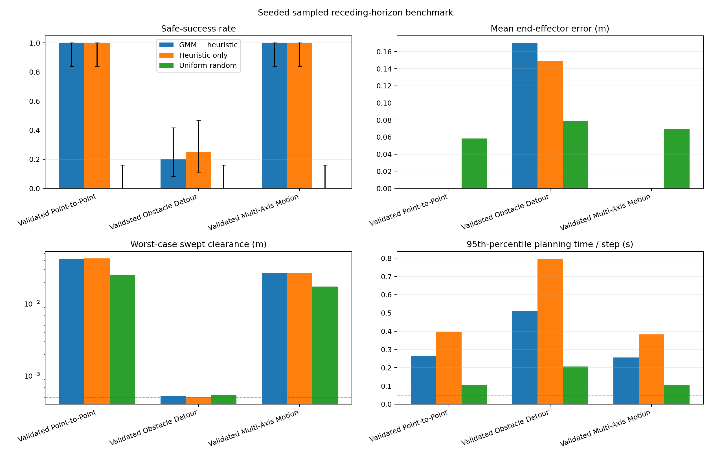

# Robotics Control and GMM-Guided Motion Planning

A technically scoped 4-DOF robotics portfolio project with two related but
computationally independent studies:

1. **Python — primary portfolio component:** kinematic GMM-guided trajectory
   sampling with MPC-style sampled receding-horizon selection.
2. **MATLAB — complementary legacy component:** a corrected implementation of a
   historical simplified dynamics and PID study whose missing physical model is
   not reconstructed or guessed.

> **Technical notebook:** [theory → code → result → interpretation](notebooks/robotics_control_planning.ipynb)
>
> **Reproducible evidence:** [raw benchmark JSON](results/corrected/benchmark/benchmark-results.json) ·
> [per-run CSV](results/corrected/benchmark/benchmark-runs.csv) ·
> [per-scenario summary](results/corrected/benchmark/benchmark-summary.csv) ·
> [overall summary](results/corrected/benchmark/benchmark-overall.csv)



## What the Python implementation does

The corrected planner uses a finite candidate budget at every control step:

1. generate complete finite-horizon kinematic trajectories;
2. optionally sample residual trajectories from a scenario-specific GMM;
3. add handcrafted or uniformly sampled candidates according to the selected
   benchmark mode;
4. reject candidates that violate joint limits, collide at a configuration, or
   fail an adaptive discretized swept-path check;
5. rank the remaining candidates using configuration error, task-space error,
   joint velocity, link clearance, and terminal error;
6. apply only the first state difference and repeat from the measured simulated
   configuration.

The implementation is accurately called:

> **GMM-guided trajectory sampling with MPC-style sampled receding-horizon selection**

It is not a neural generative model, a torque-level controller, a globally
optimal planner, or a dynamic execution model. The GMM is fitted separately for
one start-goal scenario and receives no encoded environment input.

## Corrected Python kinematic model

The planner uses an internally consistent yaw-pitch-pitch plus prismatic model.
It is independent of the MATLAB frame convention because the repository does not
contain enough DH, CAD, or calibration information to prove physical equivalence.

For radial direction

```math
r(\theta_1)=
\begin{bmatrix}
\cos\theta_1 & \sin\theta_1 & 0
\end{bmatrix}^{T},
```

the fixed-link positions are

```math
p_1=L_1e_z,
\qquad p_2=p_1+L_2r(\theta_1),
```

```math
p_3=p_2+L_3\left(\cos\theta_2\,r(\theta_1)+\sin\theta_2\,e_z\right),
```

```math
p_4=p_3+L_4\left(\cos(\theta_2+\theta_3)r(\theta_1)
+\sin(\theta_2+\theta_3)e_z\right).
```

The end effector is

```math
p_{ee}=p_4+d_4\hat d_4,
```

where `d4` extends along the unit direction of the final rigid link. Automated
tests verify all rigid-link invariants at zero and nonzero configurations.

## Link collision and clearance

Obstacles are spheres. Each robot link is treated as a line segment with a
`0.02 m` safety radius. For link endpoints `a,b` and obstacle center `c`,

```math
\alpha^*=\operatorname{clip}\left(
\frac{(c-a)^T(b-a)}{\lVert b-a\rVert^2},0,1\right),
\qquad p^*=a+\alpha^*(b-a),
```

```math
\delta=\lVert c-p^*\rVert-(r_{obs}+r_{safe}).
```

The signed post-radius clearance is exactly the link-centerline-to-obstacle-center
distance minus obstacle radius minus the `0.02 m` link radius. Hard feasibility,
the soft obstacle term, and reported clearance all use the same segment primitive
and swept-edge evaluator. The checker adaptively bisects configuration-space edges
near obstacles down to at most `0.25°` angular and `0.25 mm` prismatic intervals.
A further positive acceptance tolerance of `0.5 mm` is required, so merely
touching the inflated boundary numerically is infeasible. This remains adaptive
**discretized** checking, not analytic continuous-volume collision detection.

## Scenario-specific GMM

Let `b(q_start,q_goal)` be the step-limited straight baseline and `xi` a feasible
synthetic trajectory. The learned data are residual states after the fixed start:

```math
\rho=\operatorname{vec}\left(\xi_{1:N-1}-b_{1:N-1}\right).
```

A full-covariance mixture is fitted:

```math
p(\rho)=\sum_{k=1}^{K}\pi_k\mathcal N(\rho\mid\mu_k,\Sigma_k),
\qquad K\leq3.
```

At runtime the start state is enforced structurally by prepending a zero residual;
the goal is a soft terminal objective rather than an overwritten terminal sample.
Separate local `numpy.random.Generator` streams for offline training and online
sampling are derived reproducibly from each run seed. Direct mixture sampling does
not reset either stream on each call.

## Sampled objective

For one feasible candidate, the numerical ranking objective is

```math
J=\sum_{t=0}^{N-1}\Delta t\left[
w_t e_{q,t}^TQ_qe_{q,t}
+w_t q_p\lVert p_{ee}(q_t)-p_{ee}(q_g)\rVert^2
+\dot q_t^TQ_v\dot q_t
+q_c\max(0,d_{soft}-\delta_t)^2
\right]
+e_{q,N-1}^TQ_Te_{q,N-1}.
```

All candidates use one time step, `dt=0.05 s`, for trajectory timing, velocity,
first-action execution, simulation history, and reported execution duration.
The weights are explicit numerical ranking scales, not identified physical energy
or optimal-control matrices.

`mean_selected_horizon_cost` is the mean online ranking cost of selected candidate
horizons; it is not an executed-trajectory objective. The separate
`realized_trajectory_cost` applies the same unphased configuration, task-space,
velocity, swept-clearance, and terminal terms to every actually executed state and
edge. It therefore includes fallback and stationary steps.

Safe success requires all three angular coordinates to remain within `3°` and the
prismatic coordinate within `2 mm` for ten consecutive steps (`0.5 s`), with no
recorded collision failure. Results separately retain `reached_goal_tolerance`,
`completed_dwell`, `goal_reached`, `collision_failure`, and `safe_success`;
`goal_reached` is the compatibility name for completed dwell. Reaching tolerance
near the time limit without completing dwell is not counted as safe success.

## Seeded benchmark

The tracked benchmark is a **candidate-count-matched comparison**, not an
equal-compute comparison. All planners share the same 12-candidate online budget,
10-state horizon, `dt`, scenarios, execution model, objective, adaptive collision
checker, and stopping criteria, but their candidate generators have different
computational cost:

- `gmm_heuristic`: 50% scenario-specific GMM residual samples and 50% heuristics;
- `heuristic`: handcrafted candidates only;
- `uniform`: uniformly sampled joint-space targets with the same step limit,
  objective, and safety checks.

Configuration: seeds `0` through `19`; three synthetic endpoint-checked scenarios;
12 candidates per control step; 48 attempted GMM training trajectories; 10-state
horizon; `dt=0.05 s`; maximum simulated duration `5 s`. Twenty seeds use the
permitted portfolio-benchmark minimum because the adaptive checker makes the
30-seed alternative excessively long on the tested host.

### Measured overall results

| Sampling mode | Safe successes | Wilson 95% CI | Collision failures | Mean EE error | Realized cost | Worst post-radius clearance |
|---|---:|---:|---:|---:|---:|---:|
| GMM + heuristic | 44 / 60 (73.3%) | 61.0–82.9% | 0 / 60 | 0.0568 m | 10.597 | 0.000525 m |
| Heuristic only | 45 / 60 (75.0%) | 62.8–84.2% | 0 / 60 | 0.0498 m | 10.363 | 0.000508 m |
| Uniform random | 0 / 60 (0.0%) | 0.0–6.0% | 0 / 60 | 0.0689 m | 14.687 | 0.000551 m |

Per-scenario safe success remains visible rather than being hidden by pooling:

| Scenario | GMM + heuristic | Heuristic only | Uniform random |
|---|---:|---:|---:|
| Endpoint-checked point-to-point | 20/20 (CI 83.9–100%) | 20/20 (CI 83.9–100%) | 0/20 (CI 0–16.1%) |
| Endpoint-checked obstacle detour | 4/20 (CI 8.1–41.6%) | 5/20 (CI 11.2–46.9%) | 0/20 (CI 0–16.1%) |
| Endpoint-checked multi-axis motion | 20/20 (CI 83.9–100%) | 20/20 (CI 83.9–100%) | 0/20 (CI 0–16.1%) |

Minimum swept post-radius clearances, separated so failed/stationary runs cannot
hide the safety behavior of successful runs:

| Mode / scenario | Minimum among safe successes | Minimum among failures | Worst run |
|---|---:|---:|---:|
| GMM / point-to-point | 0.042544 m | — | 0.042544 m |
| GMM / obstacle detour | 0.000525 m | 0.000527 m | 0.000525 m |
| GMM / multi-axis | 0.026800 m | — | 0.026800 m |
| Heuristic / point-to-point | 0.042877 m | — | 0.042877 m |
| Heuristic / obstacle detour | 0.000698 m | 0.000508 m | 0.000508 m |
| Heuristic / multi-axis | 0.026800 m | — | 0.026800 m |
| Uniform / point-to-point | — | 0.025271 m | 0.025271 m |
| Uniform / obstacle detour | — | 0.000551 m | 0.000551 m |
| Uniform / multi-axis | — | 0.017504 m | 0.017504 m |

The per-run CSV and JSON retain the minimum for every individual run; the
per-scenario CSV contains the three aggregate clearance columns shown above.

The data do not show GMM superiority: heuristic-only completed one more safe run
overall and one more obstacle-detour run. No executed edge violated the configured
adaptive checker, but worst clearances sit only `0.008–0.051 mm` above the added
`0.5 mm` acceptance tolerance. This is not evidence of robust or guaranteed
physical collision avoidance.

Online timing also misses the `0.05 s` control period:

| Sampling mode | Mean / median | 95th percentile | Maximum | Deadline misses | Offline GMM fit | Mean end-to-end solver time |
|---|---:|---:|---:|---:|---:|---:|
| GMM + heuristic | 0.224 / 0.203 s | 0.482 s | 0.931 s | 96.3% | 1.056 s | 11.507 s |
| Heuristic only | 0.361 / 0.322 s | 0.742 s | 1.425 s | 99.0% | — | 17.360 s |
| Uniform random | 0.093 / 0.090 s | 0.169 s | 0.305 s | 87.5% | — | 9.419 s |

“Planning time” covers online candidate generation, safety evaluation, ranking,
selection, and fallback inside `compute_control`. GMM fitting is excluded from
that timer and reported separately. `query_solver_wall_time_s` includes fitting,
online planning, execution safety checks, and loop bookkeeping. Wall-clock values
remain host-load dependent; no mode meets a real-time deadline.

The two original historical goals that become invalid under corrected segment
checking remain preserved in `historical_scenarios()`. They are not silently
moved: the corrected benchmark uses explicitly named synthetic queries whose
endpoints pass the corrected collision predicate.

## Running and testing

Tested environment: CPython `3.13.0` with the exact package versions in
[`requirements.txt`](requirements.txt).

```bash
python -m pip install -r requirements.txt
python -B -m unittest discover -s tests -v
```

Reproduce the benchmark:

```bash
python -B src/python/benchmark_planners.py \
  --output results/corrected/benchmark \
  --duration 5 \
  --candidates 12 \
  --training-trajectories 48
```

Run the corrected GMM-guided demonstration:

```bash
python -B src/python/part2_control.py --seed 42
```

The default command uses seeds `0..19`. Each JSON result records configuration,
complete executed trajectories, every raw planning-step wall time, training status,
success subconditions, cost breakdowns, Python/platform information, and dependency
versions. CSV files provide flattened per-run and aggregate analysis tables.

## MATLAB legacy study

The MATLAB scripts remain a separate historical/simplified control study:

- [`part1_not_pid.m`](src/matlab/part1_not_pid.m)
- [`part1_pid.m`](src/matlab/part1_pid.m)
- [scope and unresolved model information](src/matlab/README.md)

The repair corrects unambiguous state, vector-shape, PID, integration, prismatic
index, and time bookkeeping errors. It does not invent units, inertial data, a DH
model, or validated `M(q)`, `C(q,qdot)`, and `G(q)` equations. A MATLAB runtime was
not available in the repair environment, so these scripts have static validation
only.

## Historical artifacts

The original source baseline is preserved by Git tag
`legacy-pre-technical-repair`. Existing figures under `assets/images/` are retained
as historical outputs and are not presented as regenerated corrected results.

| Historical MATLAB PID | Historical Python planning |
|---|---|
|  |  |

## Repository layout

```text
.
├── src/python/part2_control.py          # corrected planner and simulation
├── src/python/benchmark_planners.py     # seeded three-mode benchmark
├── src/matlab/                          # corrected legacy numerical study
├── tests/test_planner.py                # focused automated validation
├── results/corrected/benchmark/         # raw data, summaries, and corrected plots
├── notebooks/robotics_control_planning.ipynb
└── assets/images/                       # preserved historical figures
```

## Remaining limitations

- Python and MATLAB robot frames are not physically reconciled.
- The Python model is kinematic; no dynamic plant or actuator model is executed.
- Swept collision checking is adaptive and discretized rather than analytic/exact.
- Benchmark scenarios are synthetic and the experiment has twenty seeds per query.
- The obstacle-detour query remains difficult and often terminates without the
  required ten consecutive in-tolerance states.
- Worst observed accepted clearance is only about `0.508 mm` after subtracting the
  `20 mm` link radius; the configured acceptance tolerance is `0.5 mm`.
- MATLAB physical units and the original rigid-body derivation remain unresolved.

## License

Released under the [MIT License](LICENSE).
