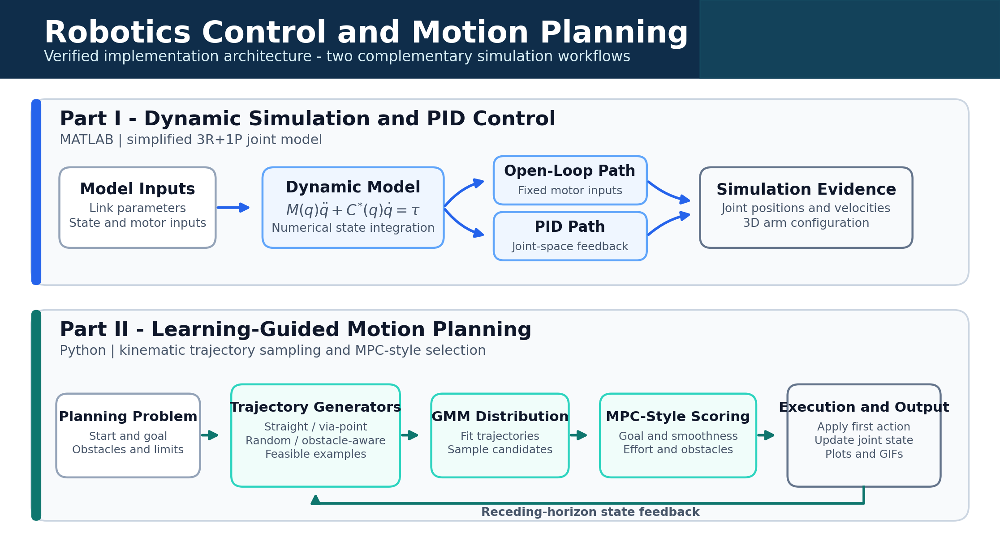

# Robotics Control and Learning-Guided Motion Planning

Simulation, control, and motion planning for a four-degree-of-freedom (4-DOF) robotic arm. The repository combines a MATLAB study of open-loop dynamics and PID position control with a Python implementation of learning-guided trajectory sampling and MPC-style receding-horizon selection.



> The figures in this repository are preserved historical simulation outputs. The current source code and the supplied figures are not fully version-aligned; known differences are documented in the technical notebook.

## Project overview

The project is organized into two complementary parts:

1. **Dynamic simulation and PID control (MATLAB)**
   - 3R+1P arm representation.
   - Lagrangian model and gravity-related terms.
   - Open-loop numerical integration.
   - Joint-space PID position control.

2. **Learning-guided motion planning (Python)**
   - Forward kinematics for a 4-DOF arm.
   - Spherical workspace obstacles.
   - Synthetic candidate-trajectory generation.
   - Gaussian Mixture Model (GMM) trajectory distribution.
   - MPC-style candidate scoring and first-action execution.
   - Configuration-space, task-space, sampling, and animation outputs.

The Python implementation is best described as **GMM-guided trajectory sampling with an MPC-style cost function**. It is inspired by learning-based sampling literature, but it does not implement a Conditional Variational Autoencoder (CVAE) or a normalizing-flow network.

## System flow

```text
MATLAB dynamics
robot parameters -> equations of motion -> open-loop / PID integration -> plots

Python planning
scenario + obstacles -> synthetic trajectories -> GMM fit -> candidate scoring
                     -> first control action -> state update -> plots and GIFs
```

## Repository structure

```text
.
├── assets/images/                   # Preserved simulation figures
├── notebooks/
│   └── robotics_control_planning.ipynb
├── src/
│   ├── matlab/
│   │   ├── part1_not_pid.m
│   │   └── part1_pid.m
│   └── python/
│       └── part2_control.py
├── .gitattributes
├── .gitignore
├── LICENSE
├── README.md
└── requirements.txt
```

## Technical notebook

The [technical notebook](notebooks/robotics_control_planning.ipynb) is the primary engineering reference. It follows a theory -> source code -> visual result -> interpretation structure and includes:

- System geometry, notation, parameters, and units.
- Lagrangian dynamics and PID equations.
- Direct links and excerpts from the MATLAB and Python implementations.
- Preserved open-loop, PID, and motion-planning figures.
- A theory-to-code crosswalk.
- Result provenance and reproducibility constraints.
- Verified implementation limitations and unresolved inconsistencies.

## Requirements

### MATLAB part

- MATLAB with core plotting and matrix operations.
- No project-specific toolbox dependency is evident from the source.

The historical MATLAB version is not recorded, so no tested-version claim is made.

### Python part

- Python 3.9 or newer is recommended.
- Dependencies listed in `requirements.txt`.

Create an isolated environment and install the dependencies:

```bash
python -m venv .venv
```

Windows PowerShell:

```powershell
.venv\Scripts\Activate.ps1
python -m pip install -r requirements.txt
```

macOS or Linux:

```bash
source .venv/bin/activate
python -m pip install -r requirements.txt
```

## Running the simulations

From MATLAB, change to `src/matlab/` and run either:

```matlab
run('part1_not_pid.m')  % Open-loop simulation
run('part1_pid.m')      % PID-controlled simulation
```

From the repository root, run the Python planning study with:

```bash
python src/python/part2_control.py
```

The Python script creates `mpc_motion_planning_output/` relative to the current working directory. It may contain configuration-space plots, task-space plots, sampling plots, GIF animations, and a summary figure.

## Preserved results

| Study | Available artifact | Provenance |
|---|---|---|
| Open-loop dynamics | Position, velocity, and arm-configuration figures | Historical supplied simulation output |
| PID control | Position, velocity, and arm-configuration figures | Historical supplied simulation output |
| Point-to-point planning | Task-space and configuration-space figures | Historical supplied simulation output |
| Complex maneuvering | Task-space and configuration-space figures | Historical supplied simulation output |

No raw result arrays, environment lockfile, or run log accompanied these figures. They should therefore be treated as preserved project evidence rather than newly reproduced benchmarks.

## Known limitations

- The supplied figures appear to originate from an earlier source revision in several places.
- The MATLAB model mixes unit systems and contains state-update and controller-mapping issues documented in the notebook.
- Python collision checking tests joint positions rather than full link segments.
- The Python planner uses a GMM, not the CVAE described by the referenced research method.
- There is no automated test suite or independently reproduced performance baseline.
- Generated PNG and GIF output is ignored by default; only curated documentation assets are tracked.

## License

Released under the [MIT License](LICENSE).
