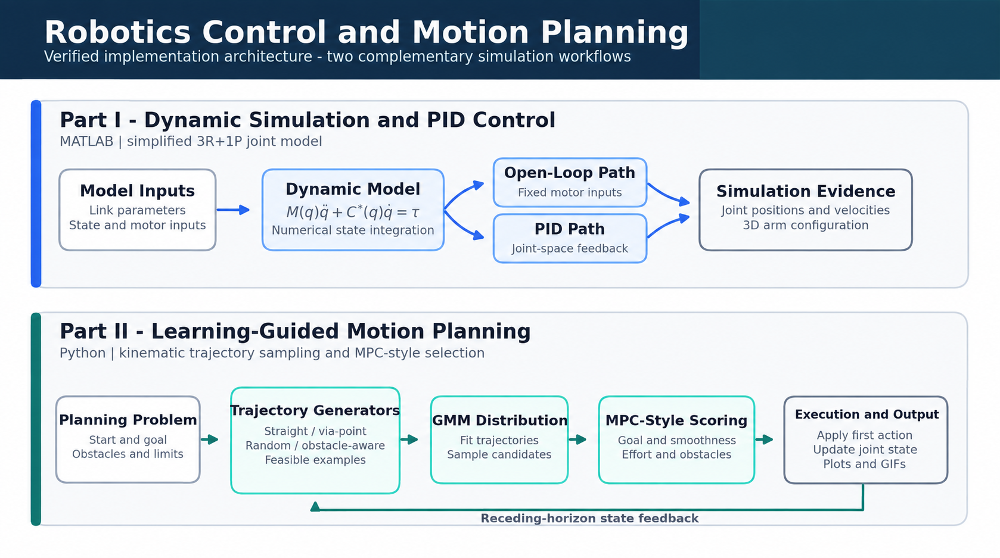
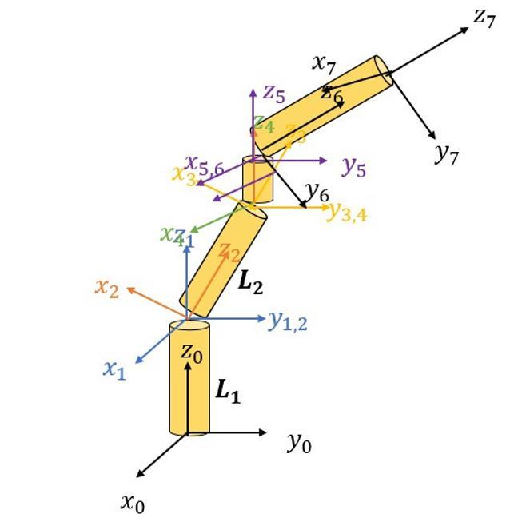
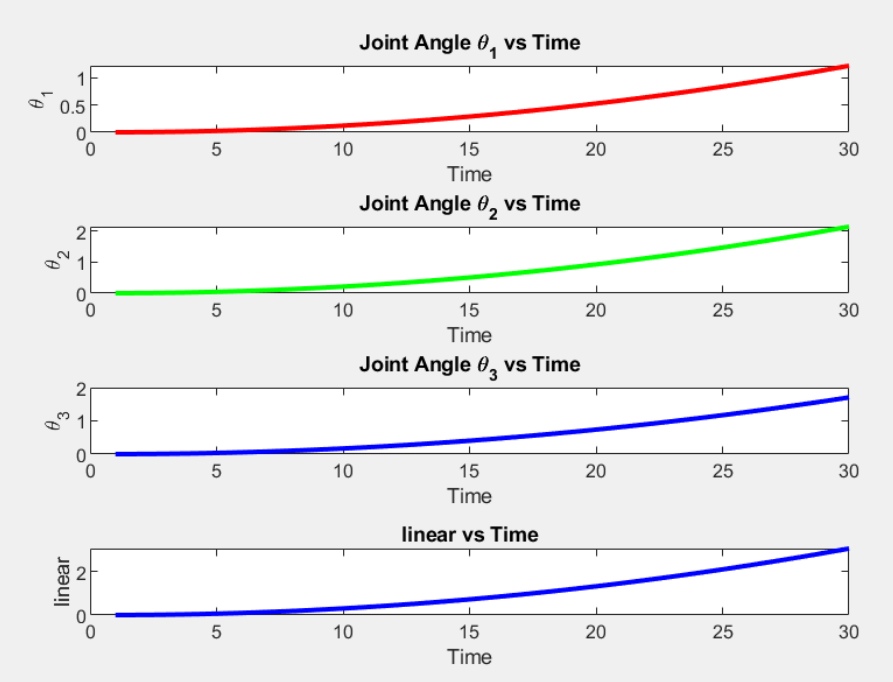
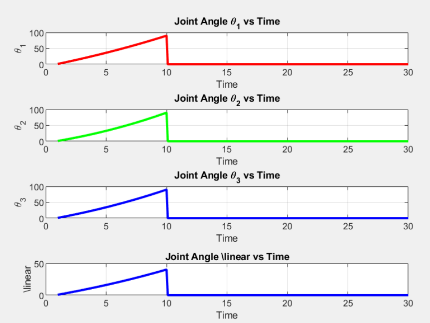
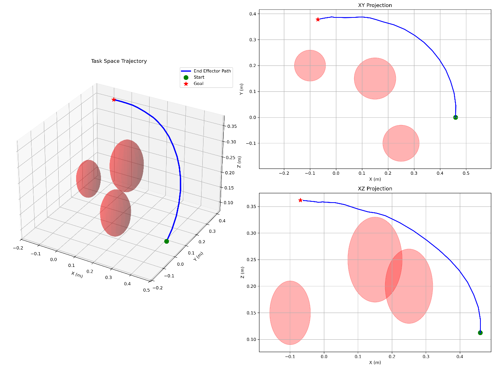
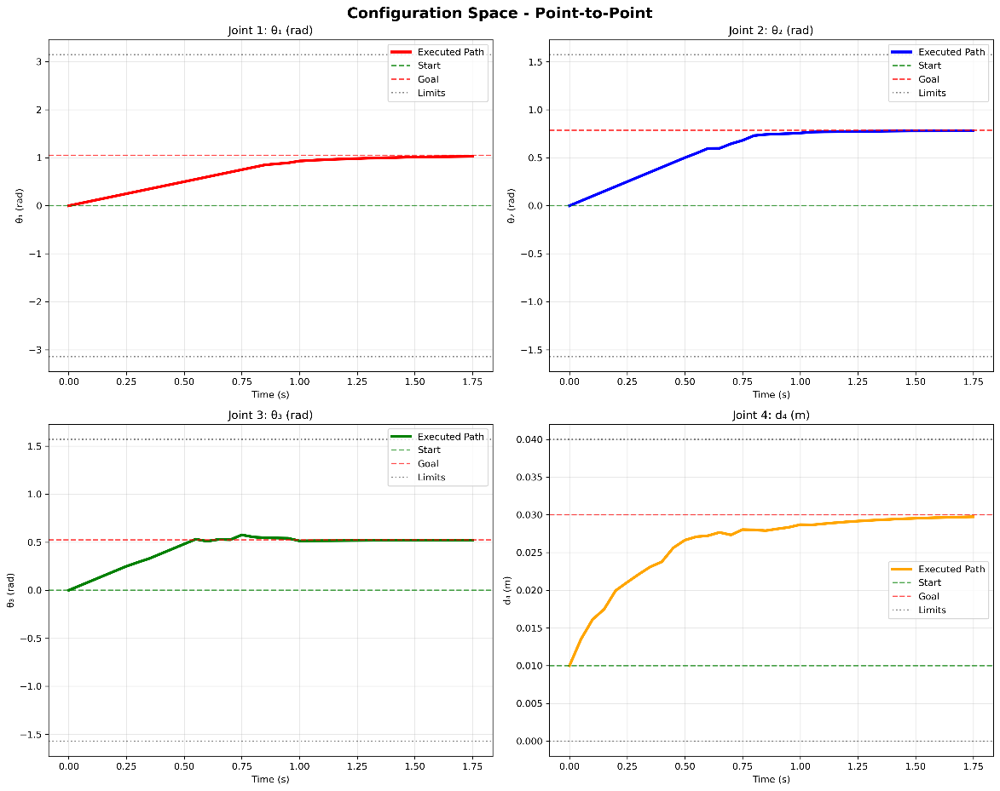
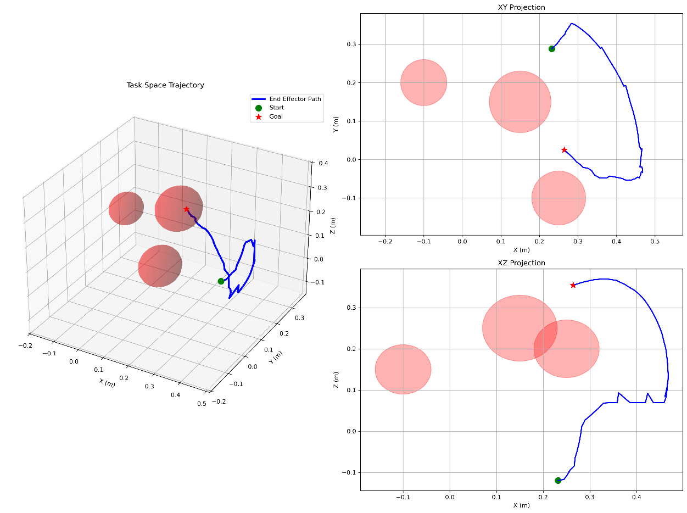
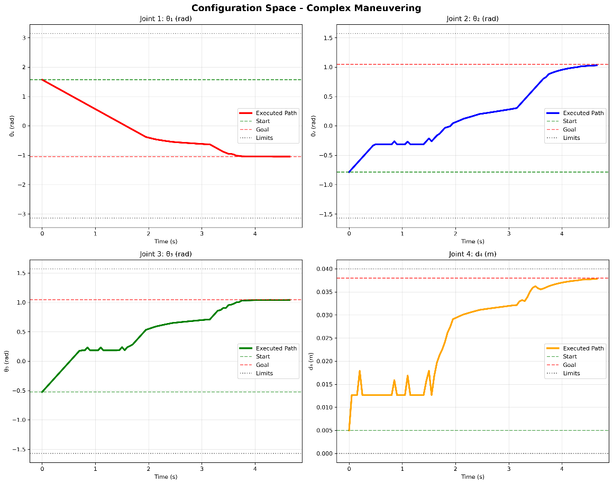
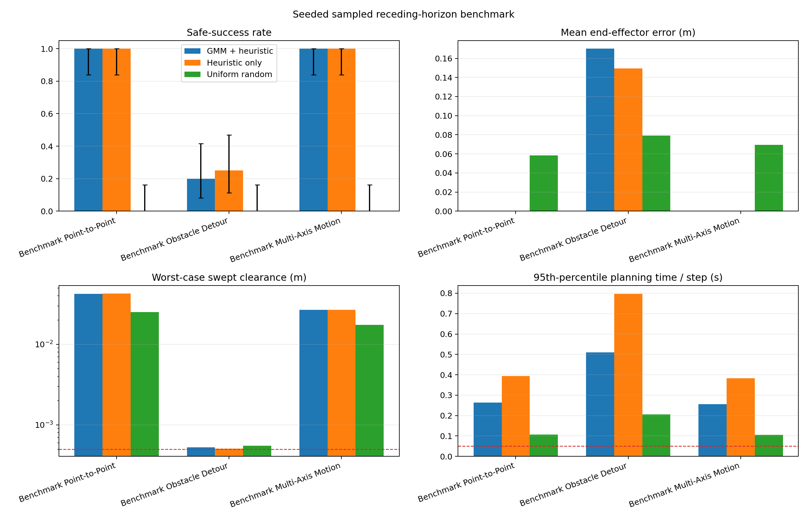

# Robotics Control and Learning-Guided Motion Planning

Simulation, control, and motion planning for a four-degree-of-freedom (4-DOF)
robotic arm. The project combines MATLAB dynamic simulation and PID position
control with Python GMM-guided trajectory sampling, MPC-style receding-horizon
selection, complete-link safety evaluation, and a reproducible seeded benchmark.

> **Start here:** open the
> [technical Jupyter notebook](notebooks/robotics_control_planning.ipynb) for the
> complete **theory → code → visual result → interpretation** walkthrough.

<p align="center">
  <a href="notebooks/robotics_control_planning.ipynb"><strong>Open the technical notebook</strong></a>
  &nbsp;·&nbsp;
  <a href="#mathematical-foundations"><strong>Mathematical foundations</strong></a>
  &nbsp;·&nbsp;
  <a href="#running-and-testing"><strong>Run the project</strong></a>
</p>

<p align="center">
  
</p>

## At a glance

| Area | MATLAB simulation and control | Python motion planning |
|---|---|---|
| Robot representation | Simplified 3R+1P dynamic model | 3R+1P kinematic model |
| Core method | Open-loop integration and joint-space PID | Sampled receding-horizon trajectory selection |
| Learned component | — | Gaussian Mixture Model fitted to feasible trajectories |
| Environment | Gravity-related model terms | Spherical workspace obstacles and complete-link clearance |
| Outputs | Joint positions, velocities, and 3D arm views | Task/configuration plots, GIFs, benchmark figures, and machine-readable metrics |
| Main implementation | [`src/matlab/`](src/matlab/) | [`src/python/part2_control.py`](src/python/part2_control.py) |

The two workflows address complementary layers of the project. MATLAB develops
the dynamic-simulation and feedback-control study, while Python develops the
kinematic planning, learned sampling, safety checking, and quantitative planner
comparison.

## Project workflow

At every Python control step, the planner:

1. constructs a finite set of complete kinematic trajectories;
2. samples scenario-specific residual trajectories from a fitted GMM and combines
   them with heuristic candidates;
3. evaluates joint limits, complete-link clearance, and adaptively discretized
   swept motion;
4. ranks feasible candidates using configuration error, task-space error, joint
   velocity, clearance, and terminal error;
5. applies the first state difference and replans from the updated configuration.

The resulting method is **GMM-guided trajectory sampling with MPC-style sampled
receding-horizon selection**. The repository also provides heuristic-only and
uniform-random modes so that the sampling strategies can be evaluated through the
same execution and scoring pipeline.

## System model

The arm has three rotary coordinates and one prismatic coordinate:

```math
q =
\begin{bmatrix}
\theta_1 & \theta_2 & \theta_3 & d_4
\end{bmatrix}^{T}.
```

<p align="center">
  
</p>

The schematic communicates the 3R+1P mechanism and its generalized coordinates.
The MATLAB dynamic formulation and Python kinematic planner use the frame and
parameter conventions required by their respective computational workflows.

### Python forward kinematics

The planner uses a yaw-pitch-pitch plus prismatic representation. For radial
direction

```math
r(\theta_1)=
\begin{bmatrix}
\cos\theta_1 & \sin\theta_1 & 0
\end{bmatrix}^{T},
```

the fixed-link positions are

```math
p_1=L_1e_z,
\qquad p_2=p_1+L_2r(\theta_1),
```

```math
p_3=p_2+L_3\left(\cos\theta_2\,r(\theta_1)+\sin\theta_2\,e_z\right),
```

```math
p_4=p_3+L_4\left(\cos(\theta_2+\theta_3)r(\theta_1)
+\sin(\theta_2+\theta_3)e_z\right).
```

The end-effector position is

```math
p_{ee}=p_4+d_4\hat d_4,
```

where `d4` extends along the unit direction of the final rigid link. Automated
tests verify the declared rigid-link lengths at zero and nonzero configurations,
joint limits, and the behavior of the prismatic extension.

## Mathematical foundations

### Lagrangian dynamics

The dynamic study begins with kinetic and potential energy:

```math
L(q,\dot q) = T(q,\dot q) - U(q),
```

```math
T_i = \frac{1}{2}m_i v_i^2 + \frac{1}{2}I_i\dot\theta_i^2,
\qquad
U = \sum_{i=1}^{5}m_i g h_i(q).
```

Applying the Euler-Lagrange equation,

```math
\frac{d}{dt}\left(\frac{\partial L}{\partial \dot q_i}\right)
- \frac{\partial L}{\partial q_i}
= \tau_i,
```

gives the standard manipulator notation

```math
M(q)\ddot q + C(q,\dot q)\dot q + G(q) = \tau.
```

The MATLAB study evaluates a compact numerical model with a constant diagonal
matrix and a configuration-dependent gravity expression. The scripts expose all
state updates and integration equations directly, making the simulation path easy
to inspect and reproduce.

### PID position control

For reference `r(t)` and measured output `y(t)`, the tracking error is

```math
e(t)=r(t)-y(t),
```

and the continuous-time PID law is

```math
u(t)=K_pe(t)+K_i\int_0^t e(\tau)\,d\tau
+K_d\frac{de(t)}{dt}.
```

The sampled implementation uses

```math
I_k=I_{k-1}+e_k\Delta t,
\qquad
D_k=\frac{e_k-e_{k-1}}{\Delta t},
```

```math
u_k=K_pe_k+K_iI_k+K_dD_k.
```

The target used in the controller study is

```math
q_d=
\begin{bmatrix}
90^\circ & 90^\circ & 90^\circ & 40\,\mathrm{mm}
\end{bmatrix}^{T}.
```

The project uses manually selected gains for the four coordinates and presents
the position response, velocity response, and 3D arm configuration together.

### Learning-guided sampling background

Learned sampling focuses candidate generation on regions associated with useful
motion while retaining exploration. A conditional generative formulation can be
written as

```math
p(x\mid y)=\int p(x\mid z,y)p(z\mid y)\,dz,
```

with a hybrid learned/exploration distribution

```math
p_{hybrid}(x\mid y)=\lambda p_{learned}(x\mid y)
+(1-\lambda)p_{explore}(x).
```

The project implements this learning-guided idea with a Gaussian mixture fitted
to complete feasible trajectory examples. This keeps the learned representation
explicit and allows direct comparison with heuristic and uniform sampling.

### Scenario-specific GMM

Let `b(q_start,q_goal)` be the step-limited straight baseline and `xi` a feasible
trajectory. The model learns residual states after the fixed start:

```math
\rho=\mathrm{vec}\left(\xi_{1:N-1}-b_{1:N-1}\right).
```

A full-covariance mixture is fitted:

```math
p(\rho)=\sum_{k=1}^{K}\pi_k\mathcal N(\rho\mid\mu_k,\Sigma_k),
\qquad K\leq3.
```

At runtime the current state is enforced structurally by prepending a zero
residual, while terminal error remains part of the candidate objective. Separate
seeded random streams are used for trajectory fitting and online sampling.

### MPC-style sampled objective

For one feasible candidate, the numerical ranking objective is

```math
J=\sum_{t=0}^{N-1}\Delta t\left[
w_t e_{q,t}^TQ_qe_{q,t}
+w_t q_p\lVert p_{ee}(q_t)-p_{ee}(q_g)\rVert^2
+\dot q_t^TQ_v\dot q_t
+q_c\max(0,d_{soft}-\delta_t)^2
\right]
+e_{q,N-1}^TQ_Te_{q,N-1}.
```

The terms balance configuration tracking, task-space tracking, motion effort,
obstacle proximity, smoothness, and terminal accuracy. One `dt=0.05 s` is used
for trajectory timing, velocity calculation, first-action execution, simulation
history, and reported simulated duration.

`mean_selected_horizon_cost` summarizes online candidate ranking. The separate
`realized_trajectory_cost` evaluates all executed states and swept edges, including
fallback and stationary steps, through the same project cost components.

## Complete-link collision checking

Obstacles are represented as spheres and each robot link as a line segment with a
`0.02 m` radius. For link endpoints `a,b` and obstacle center `c`,

```math
\alpha^*=\min\left(1,\max\left(0,
\frac{(c-a)^T(b-a)}{\lVert b-a\rVert^2}\right)\right),
\qquad p^*=a+\alpha^*(b-a),
```

```math
\delta=\lVert c-p^*\rVert-(r_{obs}+r_{link}).
```

The same signed post-radius clearance drives candidate feasibility, the obstacle
cost, selected-edge verification, fallback safety, execution safety, and reported
metrics. Edges near obstacles are adaptively subdivided to at most `0.25°`
angular and `0.25 mm` prismatic intervals. Feasible motion additionally requires
`0.5 mm` positive clearance beyond the configured link radius.

## Visual results

### Open-loop dynamics and PID control

<table>
  <tr>
    <td width="50%" align="center">
      <br>
      <strong>Open-loop joint response</strong>
    </td>
    <td width="50%" align="center">
      <br>
      <strong>PID-controlled joint response</strong>
    </td>
  </tr>
</table>

The open-loop curves show increasing coordinates under fixed inputs. The PID
curves show motion toward the requested joint coordinates. Position, velocity,
and 3D arm views are included in the notebook so that the numerical response and
mechanism motion can be read together.

### Point-to-point motion planning

<table>
  <tr>
    <td width="50%" align="center">
      <br>
      <strong>Task-space trajectory</strong>
    </td>
    <td width="50%" align="center">
      <br>
      <strong>Configuration-space response</strong>
    </td>
  </tr>
</table>

The end-effector curve and joint-coordinate response visualize progression from
the starting configuration toward the target under repeated candidate selection.

### Complex maneuvering

<table>
  <tr>
    <td width="50%" align="center">
      <br>
      <strong>Task-space maneuver</strong>
    </td>
    <td width="50%" align="center">
      <br>
      <strong>Configuration-space response</strong>
    </td>
  </tr>
</table>

The non-monotonic corrections illustrate the interaction between goal tracking,
smoothness, and obstacle-aware candidate selection during repeated replanning.

## Reproducible seeded benchmark

> **Data:** [raw benchmark JSON](results/benchmark/benchmark-results.json) ·
> [per-run CSV](results/benchmark/benchmark-runs.csv) ·
> [per-scenario summary](results/benchmark/benchmark-summary.csv) ·
> [overall summary](results/benchmark/benchmark-overall.csv)



The benchmark compares three sampling modes through the same planner and
execution pipeline:

- `gmm_heuristic`: GMM residual samples plus heuristic candidates;
- `heuristic`: handcrafted candidates;
- `uniform`: uniformly sampled joint-space targets.

All modes share the same 12-candidate online budget, 10-state horizon, `dt`,
scenarios, objective, collision checker, execution model, and stopping criteria.
The comparison is candidate-count matched; candidate-generation computation is
reported separately through measured wall-clock timing.

Configuration: seeds `0` through `19`; three evaluation scenarios; 12 candidates
per step; 48 attempted GMM fitting trajectories; 10-state horizon; `dt=0.05 s`;
and a maximum simulated duration of `5 s`.

Safe success requires all three angular coordinates to remain within `3°` and the
prismatic coordinate within `2 mm` for ten consecutive steps (`0.5 s`), with no
collision failure.

### Overall results

| Sampling mode | Safe successes | Wilson 95% CI | Collision failures | Mean EE error | Realized cost | Worst post-radius clearance |
|---|---:|---:|---:|---:|---:|---:|
| GMM + heuristic | 44 / 60 (73.3%) | 61.0–82.9% | 0 / 60 | 0.0568 m | 10.597 | 0.000525 m |
| Heuristic only | 45 / 60 (75.0%) | 62.8–84.2% | 0 / 60 | 0.0498 m | 10.363 | 0.000508 m |
| Uniform random | 0 / 60 (0.0%) | 0.0–6.0% | 0 / 60 | 0.0689 m | 14.687 | 0.000551 m |

### Per-scenario safe success

| Scenario | GMM + heuristic | Heuristic only | Uniform random |
|---|---:|---:|---:|
| Point-to-point | 20/20 (CI 83.9–100%) | 20/20 (CI 83.9–100%) | 0/20 (CI 0–16.1%) |
| Obstacle detour | 4/20 (CI 8.1–41.6%) | 5/20 (CI 11.2–46.9%) | 0/20 (CI 0–16.1%) |
| Multi-axis motion | 20/20 (CI 83.9–100%) | 20/20 (CI 83.9–100%) | 0/20 (CI 0–16.1%) |

### Swept-link clearance by scenario

The table separates completed safe runs from incomplete runs so that stationary
or time-limited behavior does not hide the clearance distribution.

| Mode / scenario | Minimum among safe successes | Minimum among incomplete runs | Worst run |
|---|---:|---:|---:|
| GMM / point-to-point | 0.042544 m | — | 0.042544 m |
| GMM / obstacle detour | 0.000525 m | 0.000527 m | 0.000525 m |
| GMM / multi-axis | 0.026800 m | — | 0.026800 m |
| Heuristic / point-to-point | 0.042877 m | — | 0.042877 m |
| Heuristic / obstacle detour | 0.000698 m | 0.000508 m | 0.000508 m |
| Heuristic / multi-axis | 0.026800 m | — | 0.026800 m |
| Uniform / point-to-point | — | 0.025271 m | 0.025271 m |
| Uniform / obstacle detour | — | 0.000551 m | 0.000551 m |
| Uniform / multi-axis | — | 0.017504 m | 0.017504 m |

The GMM and heuristic modes produce similar aggregate success in this benchmark;
the obstacle-detour case is the main source of incomplete runs. All 11,652
executed edges pass the configured complete-link swept evaluator. The smallest
accepted clearances remain close to the `0.5 mm` threshold, so the results describe
performance under the configured geometric model rather than a physical hardware
safety guarantee.

### Planning time

| Sampling mode | Mean / median | 95th percentile | Maximum | Deadline misses | GMM fitting | Mean end-to-end time |
|---|---:|---:|---:|---:|---:|---:|
| GMM + heuristic | 0.224 / 0.203 s | 0.482 s | 0.931 s | 96.3% | 1.056 s | 11.507 s |
| Heuristic only | 0.361 / 0.322 s | 0.742 s | 1.425 s | 99.0% | — | 17.360 s |
| Uniform random | 0.093 / 0.090 s | 0.169 s | 0.305 s | 87.5% | — | 9.419 s |

“Planning time” includes online candidate generation, safety evaluation, ranking,
selection, and fallback. GMM fitting is measured separately. On the benchmark
host, all three modes exceed the `0.05 s` execution period on most planning steps;
the timing data therefore establish an optimization target for future real-time
deployment.

## Running and testing

Install the Python dependencies:

```bash
python -m pip install -r requirements.txt
```

Run the automated suite:

```bash
python -B -m unittest discover -s tests -v
```

Run the GMM-guided planning demonstration:

```bash
python -B src/python/part2_control.py --seed 42
```

Reproduce the benchmark:

```bash
python -B src/python/benchmark_planners.py \
  --output results/benchmark \
  --duration 5 \
  --candidates 12 \
  --training-trajectories 48
```

The result JSON records configuration, complete executed trajectories, planning
times, fitting time, success conditions, cost breakdowns, platform information,
and dependency versions. CSV files provide per-run and aggregate views.

### MATLAB simulations

Open MATLAB, change to `src/matlab/`, and run:

```matlab
run('part1_not_pid.m')  % Open-loop simulation
run('part1_pid.m')      % PID-controlled simulation
```

The scripts display joint positions, joint velocities, and the arm configuration.
See [`src/matlab/README.md`](src/matlab/README.md) for the model equations and
implementation notes.

## Repository structure

```text
.
├── assets/images/                       # architecture and project figures
├── notebooks/
│   └── robotics_control_planning.ipynb  # theory, code, results, interpretation
├── results/benchmark/                   # benchmark data, tables, and plots
├── src/
│   ├── matlab/                          # dynamic simulation and PID control
│   └── python/
│       ├── part2_control.py             # planner and simulation
│       └── benchmark_planners.py        # three-mode seeded benchmark
├── tests/test_planner.py                # automated geometry and planner tests
├── requirements.txt
└── LICENSE
```

## Engineering scope and future directions

- The MATLAB and Python workflows use their own model conventions and address
  different layers of the project.
- The Python execution model is kinematic; dynamic plant and actuator models are
  natural extensions for hardware-oriented evaluation.
- Swept collision checking uses adaptive discretization. Analytic continuous
  collision detection would provide a stronger geometric extension.
- Twenty seeds per scenario support a portfolio benchmark and confidence
  intervals; larger campaigns would narrow comparative uncertainty.
- The obstacle-detour scenario and measured planning times identify useful targets
  for sampling, clearance, and runtime optimization.
- Physical parameter calibration and hardware measurements would extend the
  MATLAB study from numerical simulation to experimental validation.

## License

Released under the [MIT License](LICENSE).
